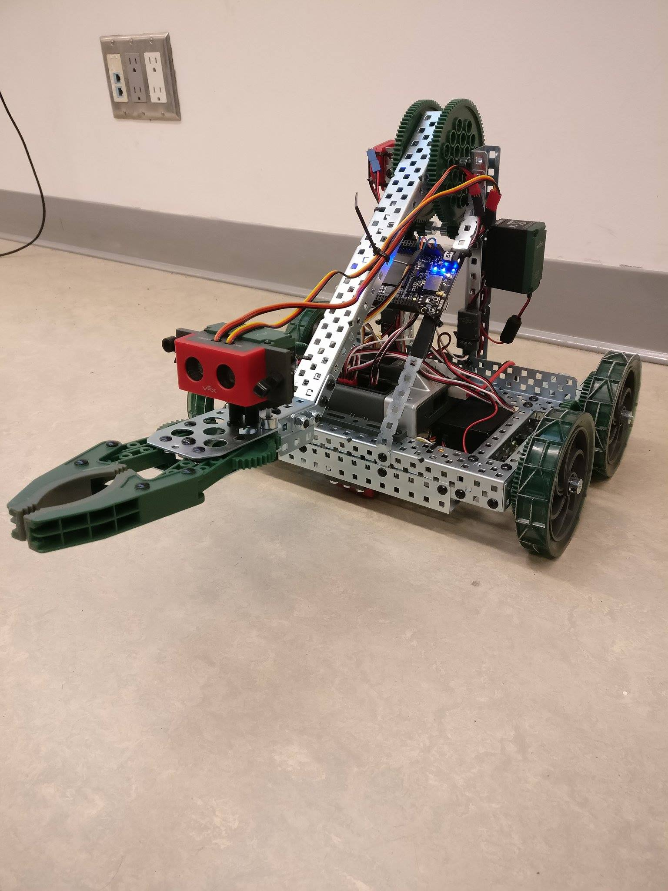
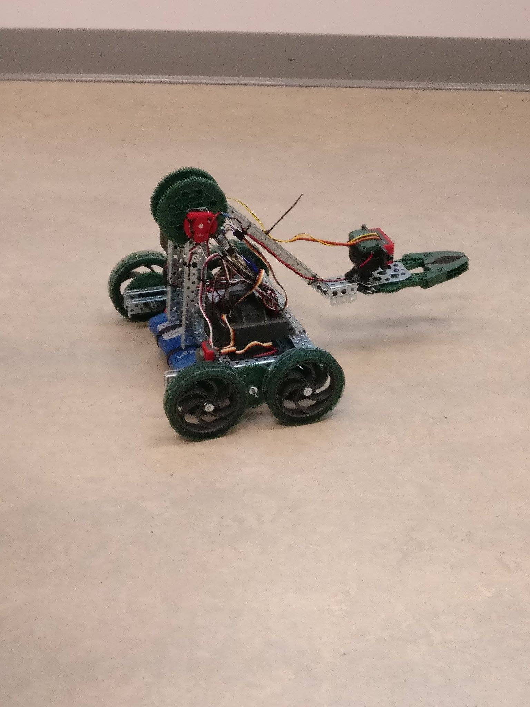
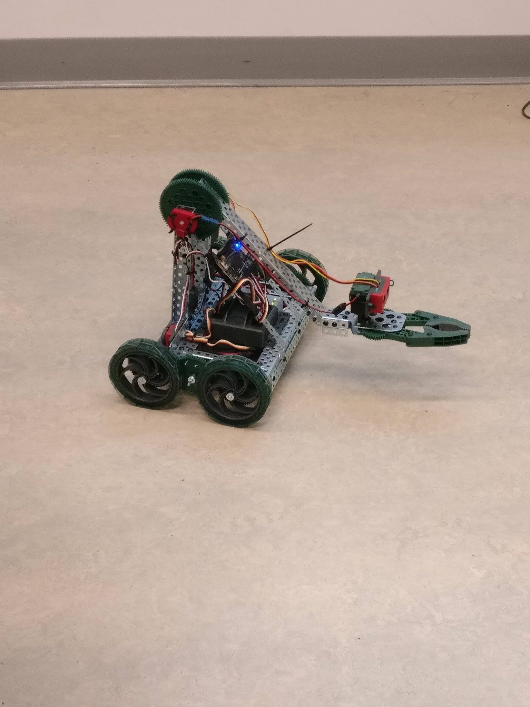

# BeagleBone Communication Program

**Team Members**: [Mera Gangapersaud](https://github.com/Mera-Gangapersaud) and [Vimal Raghubir](https://github.com/Vimal-Raghubir)

## Project Description

This program was used to interface with a BeagleBone robot using TCP/IP connections. The program was built to send commands to the robot and also receive feedback from the robot to determine whether the robot understood the command or not. 

Commands that were included were driving the robot by a certain number of seconds entered, lifting its arm up or lowering it, opening its claw or closing it, and putting the robot to sleep. 

This program was built in C++ using various techniques such as multi-threading, socket programming, CRC programming, data validation, data serialization, and object oriented programming. 

**Project Photos**

